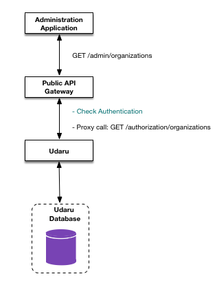
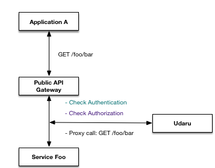

# Udaru - open source Access Manager for node.js

 Udaru is an Access Management Service designed for use in modern day microservice based Platforms/Solutions. Technically it's a Policy Based Access Control (PBAC) model, heavily inspired by Access Management in [AWS IAM](https://docs.aws.amazon.com/IAM/latest/UserGuide/introduction_access-management.html). 

It supports Organizations, Teams and User entities that are used to build the access model. The Policies attached to these entities define Actions that can be performed by an entity on various Resources.

Udaru can be used as a stand-alone node.js module ([udaru-core](https://github.com/nearform/udaru/tree/master/packages/udaru-core)), as a Hapi Plugin that provides a REST API around core ([udaru-hapi-plugin](https://github.com/nearform/udaru/tree/master/packages/udaru-hapi-plugin)) or a stand-alone server ([udaru-hapi-server](https://github.com/nearform/udaru/tree/master/packages/udaru-hapi-server)). 

## Background

Access control management evolved from the need to mitigate the risk of unauthorized access to data. Several control models were built over time to approach the various access control needs: Access Control Lists, Role Based Access Control, Attribute Based Access Control, Policy Based Access Control, Risk Adaptive Access Control. A great summary of this evolution can be found is this [survey on access control models](http://csrc.nist.gov/news_events/privilege-management-workshop/PvM-Model-Survey-Aug26-2009.pdf). 

## Core Udaru API Concepts

Udaru effectively has two interfaces:
*   An API for managing Organizations, Teams, Users, and associated Policies - this is called the _Management_ API
*   An API for managing Authorization access itself - this is called the _Authorization_ API

Both have separate use cases and are used in a Platform in a fundamentally different manner; the Management API is used to administer your Organization, Users, Teams, and Policies, while the Authorization API is used at run time for checking who has access to what.

All requests to Udaru need to attach a User ID to all endpoint requests. The User ID must be passed in the http headers as the `authorization` field. Knowing the User ID, Udaru retrieves data about the User internally, i.e. the Organization ID to which the User belongs to, the Teams to which the User belongs to, the Policies attached directly to the User or inherited via their associated Teams. This data is used at middleware level to authorize the User to access the endpoint and then evaluate the endpoint request, e.g. to manage the authorization model or to check if an Action can be performed over a Resource.

## Management API 

The Management API is used to build sophisticated Administration Tools and Applications. It is used to manage Organization, Teams, Users and their associated Policies in a Platform. Its designed in such a way that the calls in the Management API can be easily proxied directly from the public API gateway straight through to Udaru:




In the example above:
*   An administration tool (or tools) are built to manage aspects of the platform. These can be User facing or internal platform configuration, and they are always solution specific. 
*   These admin tools typically manage Users; their account details, and optionally which Teams and Organizations they belong to - again this is always solution specific
*   These admin tools also typically manage a User's access rights and permissions, although typically not directly via Policies, i.e. there might be an option to allow a User access to a specific part of the solution, this would be encapsulated in a high level api call (e.g. `allowFooAccessToBar`), which, in its implementation, attaches platform specific Policies to the User under the hood.

A brief overview of the Management API calls are as follows, see the [Swagger Documentation](swagger/index.html ":ignore") documentation for full details:

|Path|Method|Summary|
|/authorization/organizations|GET|List all the organizations|
|/authorization/organizations|POST|Create an organization|
|/authorization/organizations/{id}|DELETE|DELETE an organization|
|/authorization/organizations/{id}|GET|Get organization|
|/authorization/organizations/{id}|PUT|Update an organization|
|/authorization/organizations/{id}/policies|DELETE|Clear all policies of the organization|
|/authorization/organizations/{id}/policies|POST|Clear and replace the policies of an organization|
|/authorization/organizations/{id}/policies|PUT|Add one or more policies to an organization|
|/authorization/organizations/{id}/policies/{policyId}|DELETE|Remove a policy associated with an organization|
|/authorization/policies|GET|Fetch all the defined policies|
|/authorization/policies/search|GET|Search for policies by name|
|/authorization/policies/{id}|GET|Fetch a single policy by ID|
|/authorization/shared-policies|GET|Fetch all the defined shared policies|
|/authorization/shared-policies/search|GET|Search for shared policies by name|
|/authorization/shared-policies/{id}|GET|Fetch a single shared policy|
|/authorization/teams|POST|Create a team|
|/authorization/teams|GET|Fetch all teams from the current user organization|
|/authorization/teams/search|GET|Search for teams from the current user organization|
|/authorization/teams/{id}|DELETE|Delete a team|
|/authorization/teams/{id}|PUT|Update a team|
|/authorization/teams/{id}|GET|Fetch a team given its identifier|
|/authorization/teams/{id}/nest|PUT|Nest a team|
|/authorization/teams/{id}/nested|GET|Fetch a nested team given its identifier|
|/authorization/teams/{id}/policies|PUT|Add one or more policies to a team|
|/authorization/teams/{id}/policies|DELETE|Clear all team policies|
|/authorization/teams/{id}/policies|POST|Clear and replace policies for a team|
|/authorization/teams/{id}/unnest|PUT|Unnest a team|
|/authorization/teams/{id}/users|PUT|Add team users|
|/authorization/teams/{id}/users|GET|Fetch team users given its identifier|
|/authorization/teams/{id}/users|DELETE|Delete all team users|
|/authorization/teams/{id}/users|POST|Replace team users with the given ones|
|/authorization/teams/{id}/users/search|GET|Search for users in a team from the current user organization|
|/authorization/teams/{id}/users/{userId}|DELETE|Delete one team member|
|/authorization/teams/{teamId}/policies/{policyId}|DELETE|Remove a policy associated with a team|
|/authorization/users|POST|Create a new user|
|/authorization/users|GET|Fetch all users from the current user organization|
|/authorization/users/search|GET|Search for users from the current organization|
|/authorization/users/{id}|GET|Fetch a user given its identifier|
|/authorization/users/{id}|DELETE|Delete a user|
|/authorization/users/{id}|PUT|Update a user|
|/authorization/users/{id}/policies|DELETE|Clear all user's policies|
|/authorization/users/{id}/policies|PUT|Add one or more policies to a user|
|/authorization/users/{id}/policies|POST|Clear and replace policies for a user|
|/authorization/users/{id}/teams|DELETE|Delete teams for a user|
|/authorization/users/{id}/teams|POST|Clear and replace user teams|
|/authorization/users/{id}/teams|GET|Fetch all teams to which the user belongs to. Does not fetch parent teams.|
|/authorization/users/{userId}/policies/{policyId}|DELETE|Remove a policy associated with a user|
|/ping|GET|Ping endpoint|
cs
## Authorization API

The Authorization API is used to check User permissions as they access Platform resources. This API is intended to be called from a trusted service; they should never be called directly by a User facing API. One suggested usage pattern is to call the Authorization API from your public API Gateway, i.e. for each protected call through your gateway, check if the User is firstly Authenticated, then check if they are Authorized, e.g.



In the example above:

*   User makes a request from a solution application
*   The REST API Gateway first checks if the User is Authenticated, for example, if Auth0 is used for Authentication, it checks the JWT token
*   If the User is authenticated ok, next check if the User is authorized to perform the operation. This is done by the Gateway making a call to the `access` endpoint.
*   If the User is authorized ok, proceed in making the original call

These trusted calls are made possible by the use of a _service key_, e.g. the Gateway in our example above is configured to pass a secret service key to Udaru; it's not possible to access any of the Authorization API without this service key. You must also use the special root User id when making these service calls, this is an additional security measure. 

A brief overview of the Authorization API calls are as follows, see the live [Swagger Documentation](swagger/index.html ":ignore") documentation for full details:

|Method|Endpoint|Description|
|------|--------|-----------|
|/authorization/access/{userId}/{action}/{resource*}|GET|Authorize user action against a resource|
|/authorization/list/{userId}|GET|List all the actions a user can perform on a list of resources|
|/authorization/list/{userId}/{resource*}|GET|List all the actions a user can perform on a resource|
|/authorization/policies|POST|Create a policy for the current user organization|
|/authorization/policies/{id}|DELETE|Delete a policy|
|/authorization/policies/{id}|PUT|Update a policy of the current user organization|
|/authorization/shared-policies|POST|Create a policy shared across organizations|
|/authorization/shared-policies/{id}|DELETE|Delete a shared policy|
|/authorization/shared-policies/{id}|PUT|Update a shared policy|

## How the Authorization model works

The PBAC model can be built using the **Organization**, **Team** and **User** entities. The usual modeling case is to build independent Organizations, each Organization having Teams (or nested Teams) attached to them and users attached to Teams. Policies are attached to Organizations, Teams or Users.

**Important note:** Teams, Users and Policies can't be shared across Organizations.

### Policies 

Policies can be attached to Teams, Users and Organizations. The Policy engine evaluates all Policies from all levels when establishing if a User can perform an Action on a Resource.

A Policy is a document that describes the type of access that the Policy owner has to a resource or a group of resources. Given the Policies, the action to perform and a resource, the engine returns `true` if the action is authorized, `false` otherwise.

Users can have Policies attached to themselves, or inherit them from their Team(s) and Organization.

A Policy looks like:

```javascript
{
  id: 'Policy ID',
  version: '2016-07-01',
  name: 'Policy name',
  statements: { Statement: [{
    Effect: 'Allow',
    Action: ['Documents:Read'],
    Resource: ['wonka:documents:/public/*']
    Conditions: { 
      StringEquals: { udaru:userId: 'CharlieId' }
    }
  }] }
}
```

The main elements of a Policy are:
-   The Policy id
-   The Policy version
-   The Policy name
-   The Policy statements that contains an array of statements.

The main elements of a Statement are:
-   The Action to be performed. Example: `'authorization:teams:create'` or `'authorization:organizations:*'`
-   The Resource on which the action is performed. A Resource name is effectively a URI for your resources. Example: `'FOO:orga:CLOUDCUCKOO:scenario:*:entity:north-america-id'`
-   The Effect - has the value 'Allow' or 'Deny'.
-   The Conditions, an optional element, which contain extra logic to determine whether statement is applied or not

Note that wildcards can be used in Action and Resource names, as can certain variables, see [IAM Policy Variables Overview](https://docs.aws.amazon.com/IAM/latest/UserGuide/reference_policies_variables.html) for more details.

For a detailed description of Policies, see the [AWS Policy Elements Reference](https://docs.aws.amazon.com/IAM/latest/UserGuide/reference_policies_elements.html).

## Policy Context Variables & Conditions

IAM facilitates the use of context variables in resources and conditions.

For a detailed description of IAM Policy variable usage see the [AWS Policy Variables Reference](https://docs.aws.amazon.com/IAM/latest/UserGuide/reference_policies_variables.html)

Udaru has several system context variables that can be used in resources and conditions i.e.

-   Udaru user context variables:
    -   udaru:userId
    -   udaru:organizationId

-   Request context variables:
    -   request:source (can be either 'api' or 'server')
    -   request:sourceIp
    -   request:sourcePort
    -   request:currentTime

A good example of condition usage would be to grant access to a resource using a Policy that expires. To achieve this the DateTime condition, 'DateLessThan', can be used to grant access to a resource if the system context variable request:currentTime is evaluated as being less than the date specified in the condition.

e.g. the following condition would mean the Policy is effective until the date time specified is reached.  

```javascript
Condition: {DateLessThan: {udaru:currentTime: '2018-03-17T23:59:59Z'}}
```

For a detailed description of the condition operators see the [AWS Policy Condition Operators Reference](https://docs.aws.amazon.com/IAM/latest/UserGuide/reference_policies_elements_condition_operators.html) 

**Note:** it is envisaged that more useful context variables will be added in future releases

### Template Policies

In order to reduce complexity and duplication Udaru introduces template Policies.

For an example let's assume we want to create a generic Policy "can read document".

The regular way to do it would be with something like

```javascript
{
  id: 'Policy ID',
  version: '2016-07-01',
  name: 'Read document 1',
  statements: { Statement: [{
    Effect: 'Allow',
    Action: ['Documents:Read'],
    Resource: ['wonka:documents:/public/document-1']
  }] }
}
```

This will work, but is fixed to "document-1".

With Template Policies you could create

```javascript
{
  id: 'Policy ID',
  version: '2016-07-01',
  name: 'Read generic document',
  statements: { Statement: [{
    Effect: 'Allow',
    Action: ['Documents:Read'],
    Resource: ['wonka:documents:/public/${documentId}']
  }] }
}
```

And then provide the value for `documentId` when assigning the Policy to a User with

```javascript
{
  id: 'Policy ID',
  variables: {documentId: 'document-1'}
}
```

This will reduce the number of Policies required, while still being specific on the documents a User can read.

Policy Templates are actually regular Policies that use variables. The difference is that the value of the variables, rather than being obtained from context at run time, is defined on Policy assignment.

When a Policy is assigned to a User (or a Team) an additional object can be provided whose properties will be used as the value for the variables in the Policy itself.

Currently we support variables in the Resource part of the Policy statement (similar to what PBAC already does).

Once a policy instance is created, it is assigned an instance id, which is returned as a property of the policy instance in the policies array. This can be used to identify and delete that single instance of the policy using the query param 'instance' using the same endpoints to disassociate policies from users, teams and organizations.

## Shared Policies

Everything in Udaru is scoped by Policies and there can't be any interaction between two entities that belong to different Organizations.

However, if you are offering the same structure to all Organizations in your deployment and need to reduce complexity and duplication, Udaru offers the concept of "Shared Policies".

A Shared Policy is equal in concept to a regular Policy, but is visibile to every Organization. A shared Policy can be assigned to a User or a Team of any Organization - but can't be used to give visibility of other Organizations entities.

They can also be Policy Templates. In fact, they are designed to work together so that the Shared Policies can be customized for the need of a specific Organization.

Shared Policies work exactly as regular Policies, except that they can be created (or updated, deleted) once for all Organizations.

## Super User

In Udaru all operations are performed in the Organization context: for each User request Udaru finds the Organization to which the User belongs to and from there all middleware checks and element queries are made in the Organization context. One User can't perform operations outside the Organization to which it belongs to. The User id is passed in the HTTP headers as the `authorization` field.

There is a special type of Udaru Users, SuperUsers, that belong to the 'ROOT' Organization. SuperUsers can be assigned full access rights on all actions on all resources. To be able to do operations as SuperUser on an Organization, Udaru provides an impersonation functionality: by passing in the Http headers an 'org' field, the endpoint request is made as if the SuperUser belongs to the 'org' Organization thus having acess to all the exposed Udaru functionality for that Organization (like User management, Team management).

curl impersonation example in which a SuperUser impersonates an User belonging to the `WONKA` Organization:
```javascript
curl -X PUT --header 'Content-Type: application/json' --header 'Accept: application/json' --header 'authorization: ROOTID' --header 'org: WONKA' -d '{"policies":["PolicyID"]}' 'http://localhost:8080/authorization/teams/TeamID/policies'
```

## Next Steps

To get a feel for the Udaru APIs and sample usage, see a very contrived example [here](./example.md). 

To get up and running with Udaru, see the installation steps in the [README](https://github.com/nearform/udaru/).
